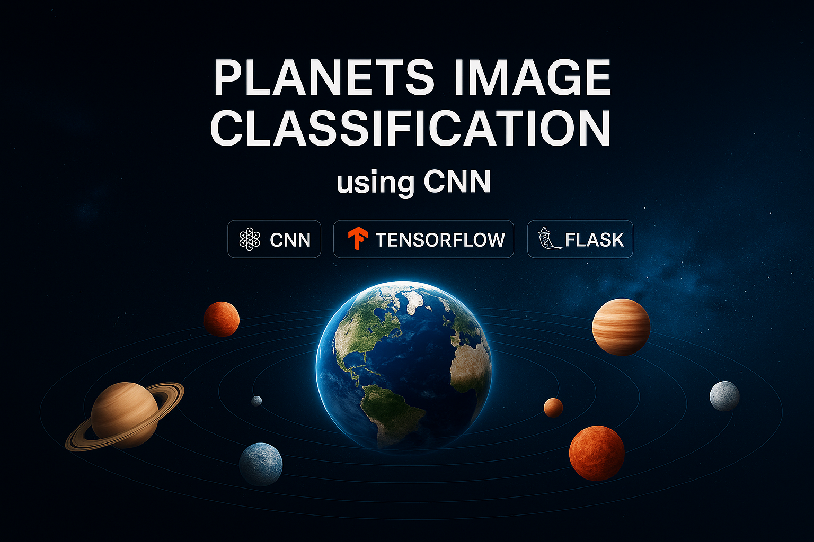
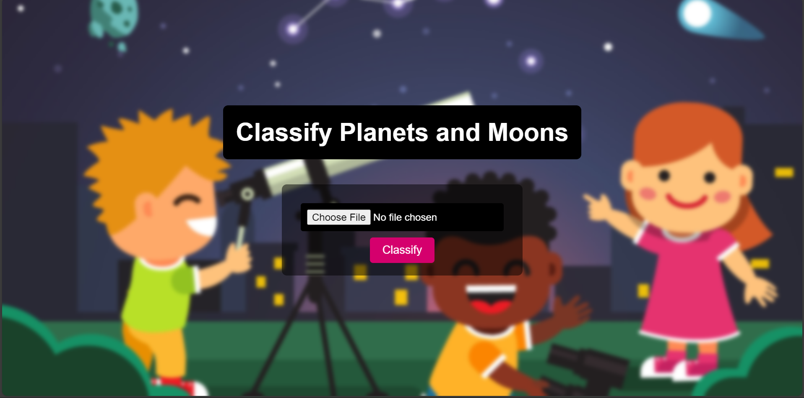

# 🌍 Planets Image Classification using CNN 🚀

<p align="center">
  
</p>

>🔭 Upload an image of a planet or moon and let a <b>Convolutional Neural Network</b>identify the celestial body instantly using a Flask web app.

<p align="center">
  <a href="#"></a>
  <a href="#"></a>
  <a href="#"></a>
  <a href="#"></a>
</p>

<hr/>

## 📌 Project Overview

This project demonstrates how **CNNs (Convolutional Neural Networks)** can be used to learn visual features from astronomical images and perform **multi-class classification**.

The user uploads an image of a planet or moon, and the trained CNN model predicts the correct celestial body.

---

## ✨ Features

* 📤 Upload planet or moon images
* 🧠 CNN-based Deep Learning model
* ⚡ Fast and accurate predictions
* 🖥️ Flask-based web interface
* 🌌 Supports multiple celestial classes

### Supported Classes

* Earth
* Jupiter
* Mars
* Mercury
* Moon
* Neptune
* Pluto
* Saturn
* Uranus
* Venus

---

## 🗂️ Dataset

* **Source:** Kaggle – *Planets and Moons Image Dataset*
* Images organized into class-wise folders
* Dataset split into training and testing sets

---

## 🧠 Model Details

* **Model Type:** Convolutional Neural Network (CNN)
* **Framework:** TensorFlow / Keras
* **Language:** Python
* **Saved Model:** `planets_and_moons_model.h5`

---

## 🛠️ Tech Stack

* Python
* Flask
* TensorFlow / Keras
* NumPy
* OpenCV / PIL
* HTML / CSS

---

## 📁 Project Structure

```
Planets_and_Moons/
│── static/
│   └── uploads/
│── templates/
│   └── index.html
│── app.py
│── Classification.ipynb
│── planets_and_moons_model.h5
│── requirements.txt
│── README.md
```

---

## ▶️ How to Run the Project

### 1️⃣ Clone the Repository

```bash
git clone https://github.com/Aryankhanf22/planet-classification.git
cd planets-and-moons-image-classification
```

### 2️⃣ Install Dependencies

```bash
pip install -r requirements.txt
```

### 3️⃣ Run the Flask App

```bash
python app.py
```

### 4️⃣ Open in Browser

```
http://127.0.0.1:5000/
```

---

## 🖼️ Screenshots

<p align="center">
  
</p>

---

## 📊 Results

* The CNN achieves good accuracy on test images
* Performs well even on visually similar planets
* Generalizes effectively to unseen images

---

## 🤝 Contributing

Contributions are welcome!

1. Fork the repository
2. Create a new branch
3. Commit your changes
4. Open a Pull Request


